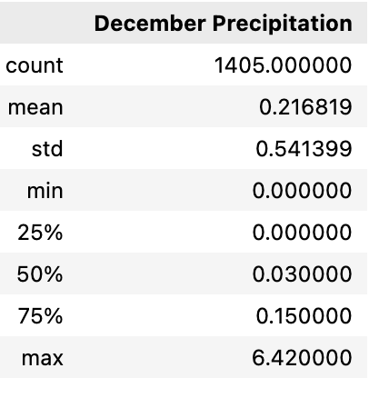

# SURFS UP CHALLENGE

# Overview of the analysis: 
I have been working with W.Avy and he asked more information about temperature trends before opening the surf shop. Data on the months of June and December in Oahu are important, in order to determine if the surf and ice cream shop business is sustainable year-round. The information I have been pulling is very important in terms of long term sustainabilty goals for the business.

# Results: 
## Temperatures

- average is around ~75 degrees Fahreinheight
- maximum being 85 degrees 

- average is around 71 degrees Fahreinheight
- maximum tempeature around 83 degrees

# Summary: 
Additional data points in our sqlite database is the precipitation data. 

- average precipitation in June is around ~0.136
- maximum amount of precipitation is ~4.4

- average precipitation in December is 0.2
- maximum precipitation in December is 6.4
